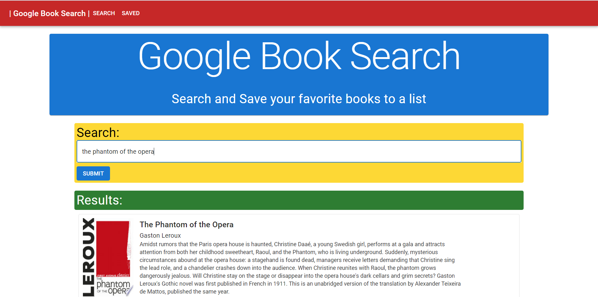

# Book Search

This app allows you to search for any book or magazine using the Google Books API. Then you can save them to your reading list and view them in the Saved page. Each book entry has an image of the book, the title, author(s), description, and a link for more info. Once your done with the book you can delete it from your reading list.

This app was made using the MERN stack and the Material-UI framework. 

[Link to the App](https://quiet-peak-07705.herokuapp.com/)